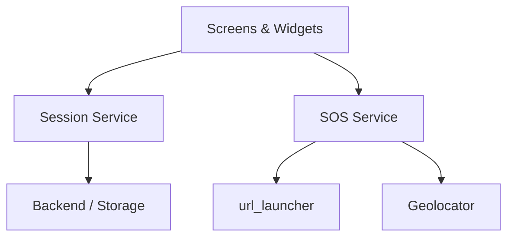

# 📡 AtlasWatch

**Stay Safe. Journey Informed.**

AtlasWatch is a comprehensive personal safety application built with Flutter. It combines real-time location tracking, predictive risk analysis, and instant emergency response to ensure you're never alone on your journey.

---

## 🚀 Key Features

### 🚨 Emergency SOS
- **Instant SMS Alerts**: Send your live location to pre-configured emergency contacts with a single tap.
- **Panic Mode**: High-visibility emergency interface for quick access in high-stress situations.

### 📍 Journey Tracking
- **Live Location Updates**: Track your progress in real-time as you move between destinations.
- **Risk Assessment**: Integrated risk scoring based on local crime data and environmental factors.

### 🛡️ Smart Safety
- **Contact Management**: Easily import and manage your emergency contacts from your device.
- **Session Intelligence**: Automated session management ensuring your safety status is always synchronized.

---

## 🛠️ Tech Stack

- **Framework**: [Flutter](https://flutter.dev/) (Dart)
- **Local Storage**: `shared_preferences`
- **Location Services**: `geolocator`, `geocoding`
- **Maps**: `flutter_map` (OpenStreetMap)
- **Communications**: `url_launcher` (SMS Integration)
- **Contacts**: `flutter_contacts`
- **Permissions**: `permission_handler`

---

## 📥 Getting Started

### Prerequisites
- Flutter SDK (^3.10.8)
- Android Studio / VS Code
- Android Emulator or Physical Device

### Installation

1. **Clone the repository**:
   ```bash
   git clone https://github.com/aarnavnk17/AtlasWatch.git
   ```

2. **Install dependencies**:
   ```bash
   flutter pub get
   ```

3. **Run the application**:
   ```bash
   flutter run
   ```

---

## 🏛️ Project Architecture



---

## 🗺️ Future Vision
- Real-time community alerts.
- AI-powered predictive safe routing.
- Wearable integration (WatchOS/WearOS).

Developed for **ADL Project**.
